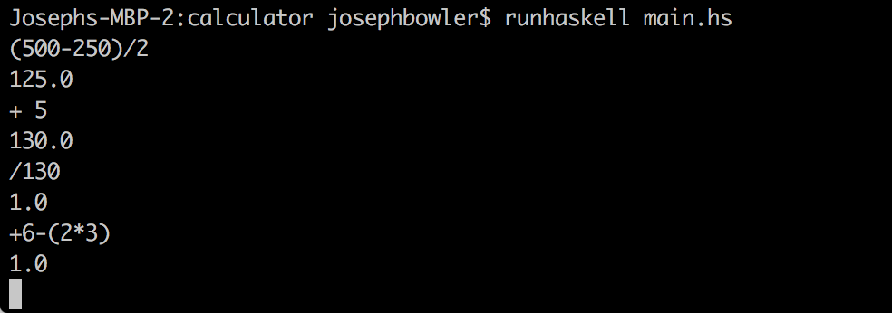

# haskell-expression-eval
A haskell program that can parse a mathematical expression, convert it to RPN, and then evaluate the result.

## Steps
 * Convert expression into a list of tokens.  Types of tokens include:
   * `LeftParen`
   * `RightParen`
   * `OpToken` (for +, -, /, \*, ^)
   * `FloatToken` for any number
 * Use shunting-yard algorithm to convert the list of tokens into RPN (Reverse Polish Notation)
 * Evaluate the RPN expression and output a result

